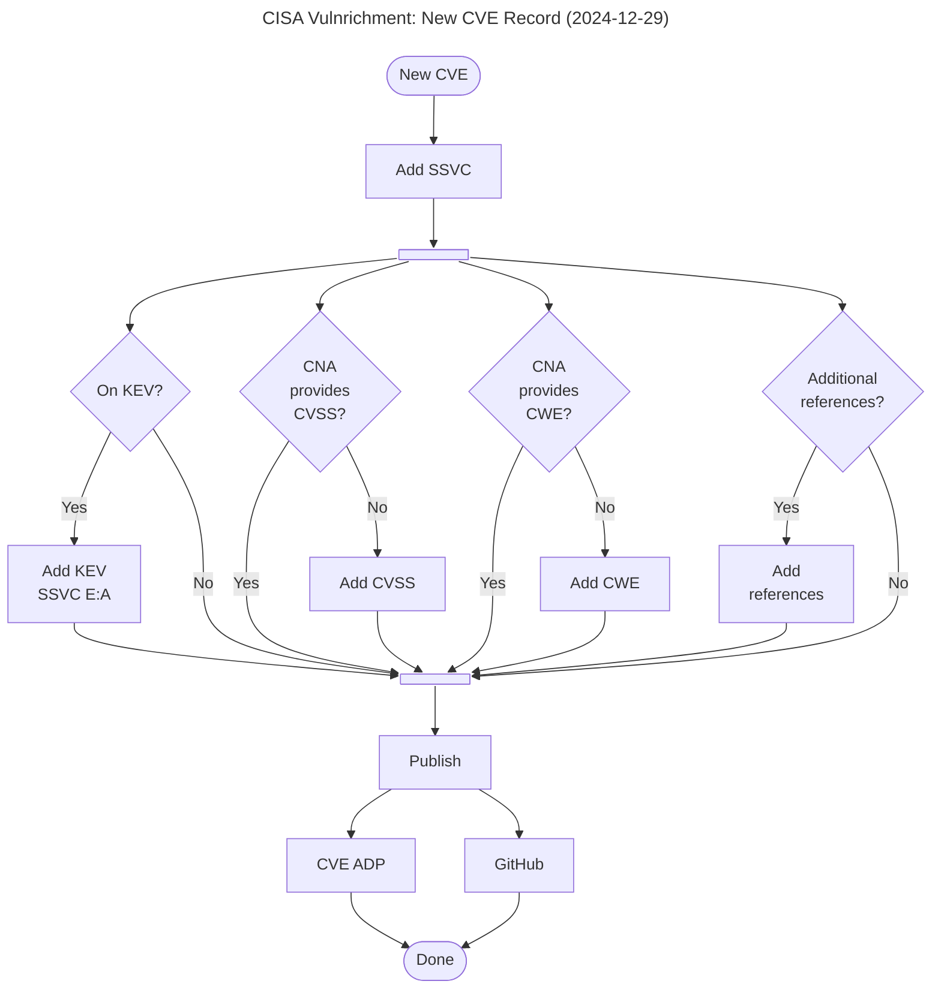
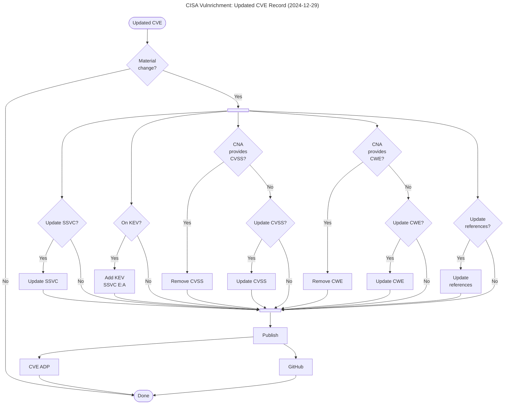

# Vulnrichment flowcharts

This is the flowchart for processing [new CVE Records](assets/flowcharts.md-1.png). 



This is the flowchart for processing [updated CVE Records](assets/flowcharts.md-2.png).



To generate images use `mermaid-cli`.

```
npm install -g @mermaid-js/mermaid-cli
mmdc -i flowcharts.md -t neutral -e png -s 2
```
